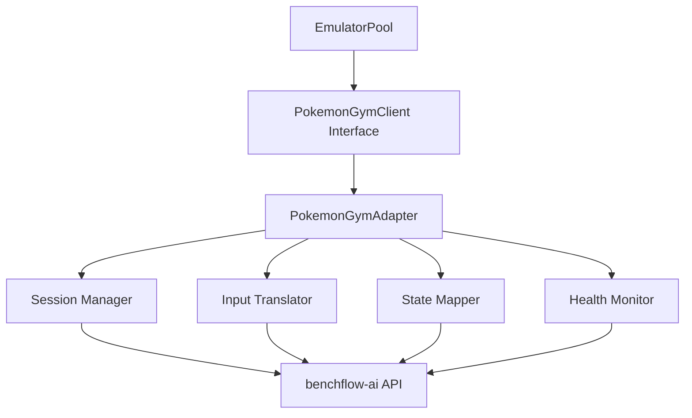
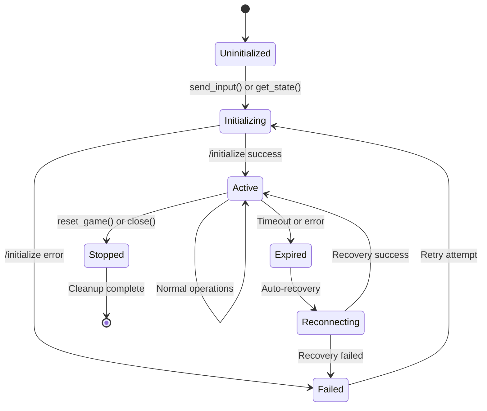

# PokemonGymAdapter Interface Specification

**Version**: 1.0
**Date**: 2025-08-16
**Author**: John Botmack - Interface Specification and Performance Engineering
**Status**: Draft

## Executive Summary

This document defines the complete interface specification for the `PokemonGymAdapter` class, which bridges our `EmulatorPool` API expectations with the `benchflow-ai/pokemon-gym` server API. The adapter implements the Adapter Pattern to provide seamless integration without modifying existing `EmulatorPool` architecture.

## Architecture Overview



The adapter maintains full compatibility with the existing `PokemonGymClient` interface while providing optimized performance and robust error handling.

## Interface Contracts

### Core Methods

#### `__init__(port: int, container_id: str, config: AdapterConfig | None = None)`

**Purpose**: Initialize adapter instance for specific Pokemon-gym container.

**Parameters**:
- `port`: HTTP port for container communication (typically 8081-8084)
- `container_id`: Docker container identifier for logging and debugging
- `config`: Optional adapter configuration (uses defaults if not provided)

**Performance Requirements**:
- Initialization must complete within 1 second
- Must not perform network operations during initialization
- Memory allocation should be < 10MB per instance

**Error Conditions**:
- `ValueError`: Invalid port number (< 1024 or > 65535)
- `TypeError`: Invalid configuration format

**Example**:
```python
adapter = PokemonGymAdapter(
    port=8081,
    container_id="pokemon-emulator-8081",
    config=AdapterConfig(
        base_url="http://localhost:8081",
        network=NetworkConfig(connect_timeout=5.0),
        session=SessionConfig(auto_initialize=True)
    )
)
```

#### `send_input(input_sequence: str) -> Dict[str, Any]`

**Purpose**: Send button input sequence to Pokemon emulator.

**Input Contract**:
- `input_sequence`: Space-separated button names ("A B START UP DOWN")
- Valid buttons: A, B, START, SELECT, UP, DOWN, LEFT, RIGHT, L, R
- Sequence length: 1-100 buttons per call
- Empty string is valid (no-op)

**Output Contract**:
```python
{
    "success": bool,           # Operation success status
    "buttons_processed": int,  # Number of buttons successfully processed
    "sequence": str,          # Original input sequence
    "execution_time_ms": float, # Time to process sequence
    "frames_advanced": int,    # Game frames that advanced
    "timestamp": float         # Unix timestamp of completion
}
```

**Performance Requirements**:
- Processing time: < 100ms for sequences up to 10 buttons
- Processing time: < 200ms for sequences up to 50 buttons
- Processing time: < 500ms for sequences up to 100 buttons
- Memory usage: < 1MB per operation
- Must support parallel calls from different threads

**Translation Logic**:
1. Parse input sequence into individual button presses
2. Initialize session if not already active
3. Send sequential `press_key` actions to benchflow-ai API
4. Apply configurable delays between buttons (default: 50ms)
5. Aggregate responses into compatible format

**Error Conditions**:
- `AdapterError`: Session initialization failed
- `ValidationError`: Invalid button names in sequence
- `TimeoutError`: Operation exceeded configured timeout
- `NetworkError`: Communication failure with Pokemon-gym server
- `SessionError`: Session expired or became invalid

**Example**:
```python
result = adapter.send_input("A B START")
# Returns: {
#   "success": True,
#   "buttons_processed": 3,
#   "sequence": "A B START",
#   "execution_time_ms": 152.3,
#   "frames_advanced": 18,
#   "timestamp": 1692198234.567
# }
```

#### `get_state() -> Dict[str, Any]`

**Purpose**: Retrieve current game state from Pokemon emulator.

**Input Contract**: No parameters required.

**Output Contract**:
```python
{
    "player_position": {       # Player location data
        "x": int,             # X coordinate
        "y": int,             # Y coordinate
        "map_id": str         # Current map identifier
    },
    "tile_grid": List[List[int]],  # 20x18 tile matrix (400 elements)
    "inventory": {             # Player inventory
        "items": Dict[str, int],   # Item name -> quantity
        "money": int              # Current money amount
    },
    "party": [                # Pokemon party (up to 6)
        {
            "species": str,    # Pokemon species name
            "level": int,      # Current level
            "hp": int,         # Current HP
            "max_hp": int,     # Maximum HP
            "status": str      # Status condition
        }
    ],
    "flags": Dict[str, bool],  # Story progress flags
    "timestamp": float,        # State capture timestamp
    "frame_count": int,        # Current frame number
    "checksum": str           # State integrity checksum (MD5)
}
```

**Performance Requirements**:
- Response time: < 50ms under normal conditions
- Response time: < 100ms under high load
- Memory usage: < 5MB per response
- State freshness: < 1 second old
- Must cache state for up to 1 second to optimize performance

**Translation Logic**:
1. Query benchflow-ai `/status` endpoint
2. Extract game state from response
3. Transform to compatible format
4. Calculate checksum for integrity verification
5. Apply caching if within TTL window

**Error Conditions**:
- `SessionError`: No active session
- `StateError`: Invalid or corrupted game state
- `TimeoutError`: State retrieval timeout
- `NetworkError`: Communication failure
- `ValidationError`: Response format validation failed

**Example**:
```python
state = adapter.get_state()
# Returns comprehensive game state dict as shown above
```

#### `reset_game() -> Dict[str, Any]`

**Purpose**: Reset Pokemon game to initial state.

**Input Contract**: No parameters required.

**Output Contract**:
```python
{
    "success": bool,           # Reset operation success
    "message": str,           # Human-readable status message
    "initial_state": Dict,    # Game state after reset (same format as get_state)
    "reset_time_ms": float,   # Time taken to perform reset
    "session_id": str,        # New session ID (if session was recreated)
    "timestamp": float        # Reset completion timestamp
}
```

**Performance Requirements**:
- Reset time: < 2 seconds for session restart
- Reset time: < 5 seconds for full container restart
- Must ensure clean state (no residual effects)
- Memory cleanup: Release all cached state

**Translation Logic**:
1. Stop current session via `/stop` endpoint
2. Initialize new session via `/initialize` endpoint
3. Verify initial game state is clean
4. Return confirmation with new session details

**Error Conditions**:
- `SessionError`: Failed to stop existing session
- `InitializationError`: Failed to create new session
- `TimeoutError`: Reset operation timeout
- `ContainerError`: Container became unresponsive

**Example**:
```python
result = adapter.reset_game()
# Returns reset confirmation with new session details
```

#### `is_healthy() -> bool`

**Purpose**: Check if Pokemon emulator is responsive and healthy.

**Input Contract**: No parameters required.

**Output Contract**: Boolean indicating health status.

**Performance Requirements**:
- Response time: < 1 second
- Lightweight operation (minimal resource usage)
- Must work even when session is inactive
- Can be called frequently (every 5-10 seconds)

**Health Check Criteria**:
1. Container is running and accessible
2. benchflow-ai server responds to `/status` endpoint
3. Response time is within acceptable limits (< 3 seconds)
4. Session is active (if one exists)
5. No recent critical errors

**Translation Logic**:
1. Attempt to query `/status` endpoint with short timeout
2. Validate response format and content
3. Check session validity if applicable
4. Return True only if all checks pass

**Error Handling**:
- Must never raise exceptions
- Always returns boolean result
- Internal errors are logged but not propagated

**Example**:
```python
healthy = adapter.is_healthy()
# Returns: True (healthy) or False (unhealthy)
```

#### `close() -> None`

**Purpose**: Clean up adapter resources and close connections.

**Input Contract**: No parameters required.

**Output Contract**: No return value.

**Performance Requirements**:
- Cleanup time: < 2 seconds
- Must be idempotent (safe to call multiple times)
- Must not raise exceptions during cleanup

**Cleanup Operations**:
1. Stop active session (if configured for cleanup)
2. Close HTTP connection pools
3. Cancel pending operations
4. Clear internal caches
5. Release memory resources

**Error Handling**:
- Errors during cleanup are logged but not raised
- Each cleanup step is isolated (failure doesn't stop others)
- Always completes successfully

**Example**:
```python
adapter.close()  # Always succeeds, no return value
```

## Session Management

### Session Lifecycle



### Auto-Recovery Behavior

The adapter implements automatic session recovery for resilient operation:

**Recovery Triggers**:
- Session timeout errors
- Network connectivity issues
- Server restart detection
- Invalid session responses

**Recovery Strategy**:
1. Detect failure condition
2. Wait for exponential backoff delay
3. Attempt session reinitialization
4. Retry original operation if recovery succeeds
5. Report failure if retry attempts exhausted

**Configuration**:
```python
SessionConfig(
    session_timeout=300.0,      # 5 minute session timeout
    heartbeat_interval=30.0,    # 30 second heartbeat
    max_retry_attempts=3,       # 3 recovery attempts
    retry_backoff_factor=2.0    # Exponential backoff
)
```

## Error Handling Specification

### Exception Hierarchy

```
AdapterError (base class)
├── NetworkError          # Network communication failures
├── SessionError         # Session management errors
├── ValidationError      # Input/output validation failures
├── TimeoutError        # Operation timeout exceeded
├── ContainerError      # Docker container issues
└── StateError          # Game state consistency errors
```

### Error Response Format

All error responses follow standardized format:

```python
{
    "error": True,
    "error_type": str,         # Error classification
    "message": str,           # Human-readable error message
    "details": Dict[str, Any], # Additional context
    "timestamp": float,       # Error occurrence time
    "retry_after": float,     # Suggested retry delay (optional)
    "operation": str,         # Failed operation name
    "request_id": str        # Unique request identifier
}
```

### Retry Policy

**Automatic Retry Conditions**:
- Network timeouts (connect/read)
- Server 5xx responses
- Session timeout/expiration
- Temporary container unavailability

**No Retry Conditions**:
- Invalid input validation
- Client 4xx errors (except 408/429)
- Resource exhaustion
- Configuration errors

**Retry Configuration**:
```python
NetworkConfig(
    retry_attempts=3,           # Maximum retry attempts
    retry_backoff=2.0,         # Exponential backoff factor
    retry_jitter=True,         # Add random jitter
    max_retry_delay=60.0       # Cap retry delay at 60 seconds
)
```

## Performance Requirements

### Service Level Agreements (SLAs)

| Operation | Target Latency | Maximum Latency | Throughput |
|-----------|---------------|-----------------|------------|
| send_input (1-10 buttons) | < 100ms | < 200ms | 100 ops/sec |
| send_input (11-50 buttons) | < 200ms | < 400ms | 50 ops/sec |
| get_state | < 50ms | < 100ms | 200 ops/sec |
| reset_game | < 2s | < 5s | 10 ops/sec |
| is_healthy | < 1s | < 3s | 500 ops/sec |

### Resource Utilization

**Memory Usage**:
- Base adapter instance: < 10MB
- Per operation overhead: < 1MB
- State cache size: < 5MB
- Total per adapter: < 20MB

**CPU Usage**:
- Background operations: < 5% CPU
- Active operations: < 20% CPU per core
- JSON parsing/validation: < 10ms per operation

**Network Usage**:
- Connection pool: 5 persistent connections
- Request payload: < 1KB average
- Response payload: < 10KB average
- Bandwidth: < 100KB/sec per adapter

### Optimization Strategies

**Input Batching**:
```python
# Instead of individual calls:
adapter.send_input("A")
adapter.send_input("B")
adapter.send_input("START")

# Use batched call:
adapter.send_input("A B START")  # 3x faster
```

**State Caching**:
- Cache get_state() responses for 1 second
- Invalidate cache after send_input() calls
- Configurable TTL via PerformanceConfig

**Connection Pooling**:
- Reuse HTTP connections
- Keep-alive for session persistence
- Pool size configurable (default: 5)

## Configuration Reference

### Complete Configuration Example

```python
config = AdapterConfig(
    base_url="http://localhost:8081",
    port=8081,
    container_id="pokemon-emulator-8081",

    network=NetworkConfig(
        connect_timeout=5.0,
        read_timeout=30.0,
        retry_attempts=3,
        retry_backoff=2.0,
        retry_jitter=True,
        max_retry_delay=60.0
    ),

    session=SessionConfig(
        auto_initialize=True,
        session_timeout=300.0,
        heartbeat_interval=30.0,
        cleanup_on_exit=True,
        persist_session=False
    ),

    performance=PerformanceConfig(
        input_batch_size=10,
        input_delay_ms=50.0,
        state_cache_ttl=1.0,
        parallel_requests=False,
        connection_pool_size=5
    ),

    logging=LoggingConfig(
        level="INFO",
        log_requests=True,
        log_responses=False,
        log_performance=True,
        log_session_events=True
    ),

    game=GameConfig(
        rom_path="/roms/pokemon_red.gb",
        save_state="/saves/initial.sav",
        speed_multiplier=1.0,
        audio_enabled=False,
        video_enabled=True,
        headless=True,
        debug_mode=False
    )
)
```

### Default Values

All configuration sections have sensible defaults:

```python
DEFAULT_CONFIG = AdapterConfig(
    base_url="http://localhost:{port}",  # Auto-populated from port
    network=NetworkConfig(
        connect_timeout=5.0,
        read_timeout=30.0,
        retry_attempts=3,
        retry_backoff=2.0,
        retry_jitter=True,
        max_retry_delay=60.0
    ),
    session=SessionConfig(
        auto_initialize=True,
        session_timeout=300.0,
        heartbeat_interval=30.0,
        cleanup_on_exit=True,
        persist_session=False
    ),
    performance=PerformanceConfig(
        input_batch_size=10,
        input_delay_ms=50.0,
        state_cache_ttl=1.0,
        parallel_requests=False,
        connection_pool_size=5
    ),
    logging=LoggingConfig(
        level="INFO",
        log_requests=True,
        log_responses=False,
        log_performance=True,
        log_session_events=True
    )
)
```

## Integration Patterns

### Factory Pattern Usage

```python
from claudelearnspokemon.pokemon_gym_adapter import create_adapter

# Create adapter with auto-configuration
adapter = create_adapter(port=8081, container_id="emulator-1")

# Create adapter with custom configuration
adapter = create_adapter(
    port=8081,
    container_id="emulator-1",
    config=custom_config
)
```

### Context Manager Pattern

```python
with create_adapter(port=8081, container_id="emulator-1") as adapter:
    # Session automatically initialized
    result = adapter.send_input("A B START")
    state = adapter.get_state()
    # Session automatically cleaned up on exit
```

### EmulatorPool Integration

The adapter is designed to be a drop-in replacement for PokemonGymClient:

```python
class EmulatorPool:
    def _create_client(self, port: int, container_id: str) -> PokemonGymClient:
        # Factory method chooses implementation
        if USE_BENCHFLOW_ADAPTER:
            return PokemonGymAdapter(port, container_id)
        else:
            return PokemonGymClient(port, container_id)
```

## Monitoring and Observability

### Performance Metrics

The adapter collects comprehensive performance metrics:

```python
metrics = adapter.get_performance_metrics()
# Returns PerformanceMetrics with:
# - Operation latencies
# - Success/failure rates
# - Network statistics
# - Session health data
# - Resource utilization
```

### Logging Events

**INFO Level Events**:
- Session initialization/termination
- Configuration changes
- Performance milestones
- Recovery operations

**DEBUG Level Events**:
- Individual API calls
- Request/response payloads
- State transitions
- Cache operations

**WARNING Level Events**:
- Retry attempts
- Performance degradation
- Configuration issues
- Session timeouts

**ERROR Level Events**:
- Operation failures
- Network errors
- Session failures
- Resource exhaustion

### Health Monitoring

```python
health_status = adapter.get_health_status()
# Returns detailed health information:
{
    "overall_health": "healthy|degraded|unhealthy",
    "session_status": "active|expired|failed|none",
    "last_operation": timestamp,
    "response_times": {
        "avg_ms": float,
        "p95_ms": float,
        "p99_ms": float
    },
    "error_rates": {
        "last_minute": float,
        "last_hour": float
    },
    "resource_usage": {
        "memory_mb": float,
        "cpu_percent": float,
        "network_kbps": float
    }
}
```

## Testing Requirements

### Unit Test Coverage

Minimum test coverage requirements:
- Core methods: 100%
- Error handling: 95%
- Configuration: 90%
- Performance paths: 85%

### Contract Tests

Each method must have contract tests that validate:
- Input parameter validation
- Output format compliance
- Performance requirements
- Error condition handling
- Resource cleanup

### Integration Tests

Full integration test suite must cover:
- End-to-end workflows
- Multi-adapter scenarios
- Container restart recovery
- Network failure handling
- Performance under load

### Performance Tests

Benchmark tests must verify:
- SLA compliance under normal load
- Degradation behavior under high load
- Memory usage stability
- Resource leak detection

## Appendix

### benchflow-ai API Reference

Complete mapping between adapter methods and benchflow-ai endpoints:

| Adapter Method | benchflow-ai Endpoint | HTTP Method | Purpose |
|---------------|----------------------|-------------|---------|
| send_input() | /initialize + /action | POST | Initialize session and send inputs |
| get_state() | /status | GET | Query game status and state |
| reset_game() | /stop + /initialize | POST | Reset session |
| is_healthy() | /status | GET | Health check |
| close() | /stop | POST | Session cleanup |

### Button Mapping

| Adapter Button | benchflow-ai Key | Alternative Names |
|---------------|-----------------|-------------------|
| A | "A" | "BUTTON_A" |
| B | "B" | "BUTTON_B" |
| START | "START" | "BUTTON_START" |
| SELECT | "SELECT" | "BUTTON_SELECT" |
| UP | "UP" | "DPAD_UP" |
| DOWN | "DOWN" | "DPAD_DOWN" |
| LEFT | "LEFT" | "DPAD_LEFT" |
| RIGHT | "RIGHT" | "DPAD_RIGHT" |
| L | "L" | "SHOULDER_L" |
| R | "R" | "SHOULDER_R" |

### Glossary

**Adapter Pattern**: Design pattern that allows incompatible interfaces to work together by wrapping one interface to match another.

**Session**: A benchflow-ai concept representing an active connection to a Pokemon emulator instance.

**State Consistency**: Ensuring game state data remains accurate and synchronized between adapter and emulator.

**Circuit Breaker**: A pattern that prevents cascading failures by temporarily disabling operations when error rates exceed thresholds.

**Backoff**: A retry strategy that increases delays between attempts to avoid overwhelming failed services.

---

**Document Control**
- Initial version: 1.0 (2025-08-16)
- Review cycle: Every Sprint
- Approval required for breaking changes
- Implementation must match specification exactly
