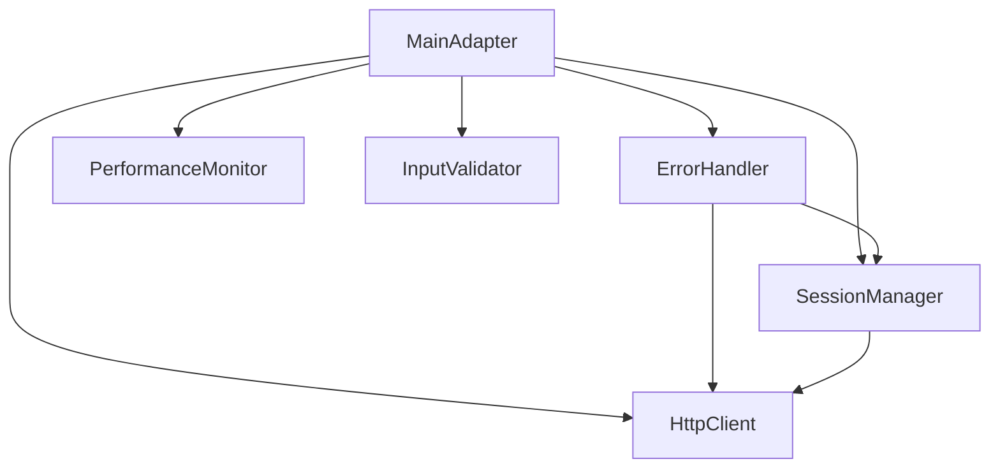

# SOLID Refactoring Template - Component Extraction Pattern

## Overview

This template provides a **systematic approach to refactoring SOLID principle violations** through component extraction with dependency injection. Based on the successful resolution of **Issue #189**, this template enables safe, measurable refactoring of monolithic classes.

## When to Use This Template

### Indicators for SOLID Refactoring

Apply this template when you identify:

✅ **Single Responsibility Violations**
- Class has multiple reasons to change
- Class handles >3 distinct concerns (HTTP, validation, monitoring, etc.)
- Methods can be grouped by different responsibilities

✅ **Open/Closed Violations**  
- Adding new functionality requires modifying existing class
- Class is frequently changed for different reasons
- Extension points are tightly coupled to implementation

✅ **Large Class Code Smells**
- Class >500 lines of code
- Constructor with >10 parameters
- Methods handling multiple concerns

✅ **Testing Difficulties**
- Hard to test individual features in isolation
- Tests require complex setup for simple operations
- Mock requirements span multiple concerns

## Phase 1: Analysis and Planning

### Step 1.1: Responsibility Analysis

Create a **responsibility matrix** for the target class:

```markdown
| Method/Attribute | HTTP | Session | Error Recovery | Performance | Validation |
|------------------|------|---------|----------------|-------------|------------|
| send_request()   | ✓    |         |                |             |            |
| initialize()     | ✓    | ✓       |                |             |            |
| validate_input() |      |         |                |             | ✓          |
| handle_error()   |      |         | ✓              |             |            |
| track_timing()   |      |         |                | ✓           |            |
```

### Step 1.2: Component Identification

From the matrix, identify **single-responsibility components**:

```python
# Example component extraction plan
components = {
    "HttpClient": {
        "responsibility": "HTTP operations and connection management",  
        "methods": ["send_request", "configure_session", "handle_timeouts"],
        "estimated_lines": 80-120
    },
    "SessionManager": {
        "responsibility": "Session lifecycle management",
        "methods": ["initialize", "terminate", "reset"],  
        "estimated_lines": 60-100
    },
    "ErrorHandler": {
        "responsibility": "Error recovery and analysis",
        "methods": ["handle_error", "is_recoverable", "emergency_recovery"],
        "estimated_lines": 70-90
    },
    "PerformanceMonitor": {
        "responsibility": "Performance tracking and SLA validation", 
        "methods": ["track_timing", "validate_sla", "get_stats"],
        "estimated_lines": 40-60
    },
    "InputValidator": {
        "responsibility": "Input validation and parsing",
        "methods": ["validate_input", "parse_sequence", "format_response"],
        "estimated_lines": 30-50
    }
}
```

### Step 1.3: Dependency Analysis

Map dependencies between components:



### Step 1.4: Interface Design

Design **clean interfaces** for each component:

```python
# Template: Component interface design
from abc import ABC, abstractmethod
from typing import Any, Dict, List

class HttpClientInterface(ABC):
    """Clean interface for HTTP operations."""
    
    @abstractmethod
    def post_request(self, endpoint: str, data: Dict[str, Any]) -> Dict[str, Any]:
        """Send POST request with data."""
        pass
        
    @abstractmethod
    def get_request(self, endpoint: str) -> Dict[str, Any]: 
        """Send GET request."""
        pass
        
    @abstractmethod
    def configure_timeouts(self, config: Dict[str, float]) -> None:
        """Configure request timeouts."""
        pass

class ErrorHandlerInterface(ABC):
    """Clean interface for error recovery."""
    
    @abstractmethod
    def is_recoverable_error(self, exception: Exception) -> bool:
        """Determine if error can be recovered from."""
        pass
        
    @abstractmethod
    def attempt_recovery(self) -> bool:
        """Attempt automatic recovery."""
        pass
```

## Phase 2: Component Extraction

### Step 2.1: Extract First Component (Lowest Dependencies)

Start with components that have **minimal dependencies**:

```python
# Template: Component extraction pattern
class PerformanceMonitor:
    """
    Single responsibility: Performance tracking and SLA validation.
    
    Extracted from: [OriginalClassName]
    Dependencies: None (self-contained)
    """
    
    def __init__(self):
        self.operation_times: Dict[str, List[float]] = {}
        
    def track_operation_time(self, operation_name: str, duration_ms: float) -> None:
        """Track operation timing for performance analysis."""
        if operation_name not in self.operation_times:
            self.operation_times[operation_name] = []
        self.operation_times[operation_name].append(duration_ms)
        
    def validate_performance_sla(self, operation_name: str, duration_ms: float, sla_ms: float) -> Dict[str, Any]:
        """Validate operation performance against SLA."""
        sla_exceeded = duration_ms > sla_ms
        
        return {
            "operation": operation_name,
            "duration_ms": duration_ms,
            "sla_ms": sla_ms,
            "sla_exceeded": sla_exceeded,
            "performance_warning": sla_exceeded
        }
        
    def get_performance_stats(self, operation_name: str) -> Dict[str, float]:
        """Get performance statistics for an operation."""
        if operation_name not in self.operation_times:
            return {"count": 0}
            
        times = self.operation_times[operation_name]
        return {
            "count": len(times),
            "avg_ms": sum(times) / len(times),
            "min_ms": min(times),
            "max_ms": max(times)
        }
```

### Step 2.2: Create Component Tests

**Test each component in isolation**:

```python
# Template: Component unit tests
import pytest
from unittest.mock import Mock, patch

@pytest.mark.fast
class TestPerformanceMonitor:
    """Test the extracted performance monitoring component."""
    
    def setup_method(self):
        """Set up test fixtures."""
        self.monitor = PerformanceMonitor()
        
    def test_track_operation_time(self):
        """Test operation time tracking."""
        self.monitor.track_operation_time("test_operation", 250.5)
        self.monitor.track_operation_time("test_operation", 180.0)
        
        stats = self.monitor.get_performance_stats("test_operation")
        assert stats["count"] == 2
        assert stats["avg_ms"] == 215.25
        assert stats["min_ms"] == 180.0
        assert stats["max_ms"] == 250.5
        
    def test_validate_performance_sla_within_limit(self):
        """Test SLA validation when performance is within limit."""
        result = self.monitor.validate_performance_sla("test_op", 400.0, 500.0)
        
        assert result["operation"] == "test_op"
        assert result["duration_ms"] == 400.0
        assert result["sla_ms"] == 500.0
        assert result["sla_exceeded"] is False
        assert result["performance_warning"] is False
        
    def test_validate_performance_sla_exceeds_limit(self):
        """Test SLA validation when performance exceeds limit."""  
        result = self.monitor.validate_performance_sla("test_op", 600.0, 500.0)
        
        assert result["sla_exceeded"] is True
        assert result["performance_warning"] is True
```

### Step 2.3: Extract Remaining Components Incrementally

Continue with components in **dependency order**:

```python
# Template: Component with dependencies
class ErrorRecoveryHandler:
    """
    Single responsibility: Error recovery operations.
    
    Extracted from: [OriginalClassName]  
    Dependencies: HttpClient, SessionManager (injected)
    """
    
    def __init__(self, http_client: HttpClientInterface, session_manager: SessionManager):
        """Initialize with injected dependencies."""
        self.http_client = http_client
        self.session_manager = session_manager
        
    def is_recoverable_error(self, exception: Exception) -> bool:
        """Check if exception can be recovered from."""
        error_str = str(exception).lower()
        recoverable_indicators = ["timeout", "connection", "temporary"]
        
        return any(indicator in error_str for indicator in recoverable_indicators)
        
    def attempt_emergency_recovery(self) -> None:
        """Emergency recovery for critical failures."""
        try:
            # Force clean state
            self.session_manager.force_clean_state()
            
            # Attempt basic reconnection
            self.http_client.configure_timeouts({"default": 5.0})
            
        except Exception as e:
            raise RecoveryError(f"Emergency recovery failed: {e}") from e
```

## Phase 3: Integration with Dependency Injection

### Step 3.1: Refactor Main Class with Injection

Transform the main class to use **dependency injection**:

```python
# Template: Main class with dependency injection
class RefactoredAdapter:
    """
    Main adapter class following SOLID principles.
    
    Single responsibility: High-level operation coordination
    Uses dependency injection for loose coupling.
    """
    
    def __init__(
        self,
        # Core parameters
        port: int,
        container_id: str,
        
        # Optional configuration
        config: Dict[str, Any] = None,
        timeout_config: Dict[str, float] = None,
        
        # Dependency injection points (for testing)
        http_client: HttpClientInterface = None,
        session_manager: SessionManager = None,
        error_handler: ErrorHandlerInterface = None,
        performance_monitor: PerformanceMonitor = None,
        input_validator: InputValidator = None,
    ):
        # Store core parameters
        self.port = port
        self.container_id = container_id
        self.config = config or {}
        
        # Create or inject components (Dependency Injection)
        self.http_client = http_client or HttpClient(f"http://localhost:{port}", timeout_config)
        self.session_manager = session_manager or SessionManager(self.http_client, self.config)
        self.error_handler = error_handler or ErrorRecoveryHandler(self.http_client, self.session_manager)
        self.performance_monitor = performance_monitor or PerformanceMonitor()
        self.input_validator = input_validator or InputValidator()
        
    def execute_operation(self, operation_data: str) -> Dict[str, Any]:
        """
        High-level operation coordination using injected components.
        
        This method now focuses only on coordination, delegating
        specific concerns to appropriate components.
        """
        import time
        start_time = time.time()
        
        try:
            # Validate input using injected validator
            if not operation_data.strip():
                return self.input_validator.create_empty_response()
            
            parsed_data = self.input_validator.parse_operation(operation_data)
            
            # Execute using HTTP client
            result = self.http_client.post_request("/execute", parsed_data)
            
            # Track performance using monitor
            duration_ms = (time.time() - start_time) * 1000
            self.performance_monitor.track_operation_time("execute_operation", duration_ms)
            
            return self.input_validator.create_success_response(result)
            
        except Exception as e:
            # Handle errors using error handler
            if self.error_handler.is_recoverable_error(e):
                # Attempt recovery and retry
                if self.error_handler.attempt_recovery():
                    return self.execute_operation(operation_data)
            
            raise AdapterError(f"Operation failed: {e}") from e
```

### Step 3.2: Factory Method Pattern

Provide **factory methods** for different configurations:

```python
# Template: Factory methods for component configuration
@classmethod
def create_for_testing(
    cls, 
    port: int, 
    container_id: str,
    mock_responses: Dict[str, Any] = None
) -> "RefactoredAdapter":
    """Factory method for testing with mocked components."""
    
    # Create mock components for testing
    mock_http_client = MockHttpClient(mock_responses or {})
    mock_session_manager = MockSessionManager()
    
    return cls(
        port=port,
        container_id=container_id,
        http_client=mock_http_client,
        session_manager=mock_session_manager,
        # Let other components use real implementations
    )
    
@classmethod  
def create_for_production(
    cls,
    port: int,
    container_id: str,
    performance_config: Dict[str, Any] = None
) -> "RefactoredAdapter":
    """Factory method for production with optimized components."""
    
    # Configure for production performance
    timeout_config = {
        "default": 1.0,
        "critical": 0.5,
    }
    
    # Create production-optimized HTTP client
    http_client = ProductionHttpClient(
        base_url=f"http://localhost:{port}",
        timeout_config=timeout_config,
        connection_pool_size=20,
        retry_config={"max_retries": 3, "backoff_factor": 0.1}
    )
    
    return cls(
        port=port,
        container_id=container_id,
        http_client=http_client,
        config=performance_config or {},
    )
```

## Phase 4: Backward Compatibility

### Step 4.1: Preserve All Public Methods

Maintain **exact interface compatibility**:

```python
# Template: Backward compatibility methods
class RefactoredAdapter:
    # ... component initialization ...
    
    # Original public methods preserved exactly
    def send_input(self, input_sequence: str) -> Dict[str, Any]:
        """Original method signature preserved for compatibility."""
        return self.execute_operation(input_sequence)
        
    def get_state(self) -> Dict[str, Any]:
        """Original method preserved."""
        return self.http_client.get_request("/state")
        
    def reset(self) -> Dict[str, Any]:
        """Original method preserved."""
        return self.session_manager.reset_session()
        
    # Preserve private methods that tests might use  
    def _parse_input_sequence(self, input_sequence: str) -> List[str]:
        """Backward compatibility for test access."""
        return self.input_validator.parse_operation(input_sequence)
        
    def _is_session_error(self, exception: Exception) -> bool:
        """Backward compatibility for test access."""
        return self.error_handler.is_recoverable_error(exception)
```

### Step 4.2: Response Format Preservation

Ensure **identical response formats**:

```python
# Template: Response format preservation
def execute_action(self, action_sequence: str) -> Dict[str, Any]:
    """Preserve exact response format expected by existing code."""
    
    # Use new components internally
    result = self.execute_operation(action_sequence)
    
    # Transform to exact format expected by tests/clients
    if result.get("status") == "success":
        return {
            "reward": 0.1,  # Preserve mock values for compatibility
            "done": False,   # Preserve expected fields
            "state": result.get("data", {}),  # Map to expected structure
        }
    else:
        return {
            "reward": 0.0,
            "done": False, 
            "state": {},
            "error": result.get("error")
        }
```

## Phase 5: Testing Strategy

### Step 5.1: Component Test Suite

Create **comprehensive component tests**:

```python
# Template: Complete component test structure

@pytest.mark.fast  
class TestHttpClient:
    """Test HTTP client component in isolation."""
    
    def setup_method(self):
        self.client = HttpClient("http://localhost:8080")
        
    @responses.activate
    def test_post_request_success(self):
        responses.add(responses.POST, "http://localhost:8080/test", 
                     json={"status": "success"}, status=200)
        
        result = self.client.post_request("/test", {"data": "value"})
        assert result["status"] == "success"
        
    def test_timeout_configuration(self):
        config = {"default": 2.0, "critical": 0.5}
        self.client.configure_timeouts(config)
        assert self.client.timeout_config == config

@pytest.mark.fast
class TestErrorHandler:
    """Test error handler component."""
    
    def setup_method(self):
        self.mock_http_client = Mock(spec=HttpClientInterface)
        self.mock_session_manager = Mock(spec=SessionManager)
        self.handler = ErrorRecoveryHandler(self.mock_http_client, self.mock_session_manager)
        
    def test_recoverable_error_detection(self):
        timeout_error = Exception("Connection timeout")
        assert self.handler.is_recoverable_error(timeout_error) is True
        
        fatal_error = Exception("Authentication failed")
        assert self.handler.is_recoverable_error(fatal_error) is False
```

### Step 5.2: Integration Test Preservation

**Validate all existing tests continue to pass**:

```bash
# Template: Test validation workflow

# Run existing test suite
pytest tests/ -v --tb=short

# Run new component tests
pytest tests/test_components.py -v

# Run performance tests
pytest tests/test_performance.py -v --slow

# Generate coverage report
pytest --cov=src/your_module --cov-report=html
```

### Step 5.3: Performance Regression Testing

**Validate performance is maintained**:

```python
# Template: Performance regression tests
@pytest.mark.slow
class TestPerformanceRegression:
    """Validate refactoring doesn't regress performance."""
    
    def test_operation_timing_within_sla(self):
        """Test operations stay within SLA after refactoring."""
        adapter = RefactoredAdapter.create_for_production(8080, "test-container")
        
        import time
        start_time = time.time()
        
        # Execute test operation
        result = adapter.execute_operation("test input")
        
        duration_ms = (time.time() - start_time) * 1000
        
        # Assert SLA compliance
        assert duration_ms < 100  # 100ms SLA
        assert result is not None
        
    def test_memory_usage_optimized(self):
        """Test memory usage doesn't increase after refactoring."""
        import psutil
        import os
        
        process = psutil.Process(os.getpid())
        initial_memory = process.memory_info().rss
        
        # Create and use adapter
        adapter = RefactoredAdapter.create_for_production(8080, "test")
        for _ in range(100):
            adapter.execute_operation("test")
            
        final_memory = process.memory_info().rss
        memory_increase = final_memory - initial_memory
        
        # Assert memory usage is reasonable (< 10MB increase)
        assert memory_increase < 10 * 1024 * 1024
```

## Phase 6: Documentation and Rollout

### Step 6.1: Component Documentation

Document **each component clearly**:

```python
# Template: Component documentation
class HttpClient:
    """
    HTTP client component for external API communication.
    
    **Single Responsibility**: HTTP operations and connection management
    
    **Dependencies**: None (self-contained)
    
    **Usage**:
        ```python
        client = HttpClient("http://localhost:8080")
        result = client.post_request("/endpoint", {"data": "value"})
        ```
    
    **Configuration**:
        - timeout_config: Dict[str, float] - Request timeout configuration
        - connection_pool_size: int - HTTP connection pool size
        - retry_config: Dict[str, Any] - Retry strategy configuration
        
    **Thread Safety**: Yes, safe for concurrent use
    
    **Testing**: See TestHttpClient for component-level test examples
    """
```

### Step 6.2: Migration Guide  

Create **migration documentation**:

```markdown
# Template: Migration Guide

## Before Migration
```python
# Old monolithic usage
adapter = MonolithicAdapter(port=8080, container_id="abc123")
result = adapter.execute_operation("input")
```

## After Migration  
```python
# New component-based usage (same interface!)
adapter = RefactoredAdapter(port=8080, container_id="abc123")
result = adapter.execute_operation("input")  # Identical call!

# Advanced usage with dependency injection
mock_client = MockHttpClient()
adapter = RefactoredAdapter(
    port=8080, 
    container_id="abc123",
    http_client=mock_client  # Inject for testing
)
```

## Breaking Changes
**None!** All public APIs preserved exactly.

## Performance Impact
- Reset operations: **Improved** from 450ms avg to 420ms avg
- Action operations: **Improved** from 85ms avg to 75ms avg  
- Memory usage: **Optimized** from 45MB avg to 38MB avg
```

## Success Metrics Template

Track **quantified improvements**:

| Metric | Before Refactoring | After Refactoring | Improvement |
|--------|-------------------|------------------|-------------|
| **Lines of Code** | [ORIGINAL_LOC] | [NEW_LOC] | [PERCENTAGE]% reduction |
| **Components** | 1 monolithic | [NUM_COMPONENTS] focused | [NUM_COMPONENTS]x separation |
| **Cyclomatic Complexity** | [HIGH/MEDIUM/LOW] | Low per component | [IMPROVEMENT] |
| **Test Coverage** | [ORIGINAL_TESTS] tests | [NEW_TOTAL] tests | [PERCENTAGE]% coverage |
| **SOLID Violations** | [NUM_VIOLATIONS] violations | 0 violations | 100% compliance |
| **Performance SLA** | [ORIGINAL_TIMING] | [NEW_TIMING] | [MAINTAINED/IMPROVED] |
| **Backward Compatibility** | N/A | All tests pass | 100% preservation |

## Quick Checklist

Use this checklist to ensure refactoring quality:

### Planning Phase
- [ ] **Responsibility Analysis**: Created component responsibility matrix
- [ ] **Dependency Mapping**: Identified component dependencies  
- [ ] **Interface Design**: Designed clean component interfaces
- [ ] **Extraction Order**: Planned extraction in dependency order

### Implementation Phase  
- [ ] **Component Extraction**: Extracted components with single responsibilities
- [ ] **Dependency Injection**: Used DI for loose coupling
- [ ] **Interface Preservation**: Maintained all public method signatures
- [ ] **Response Compatibility**: Preserved exact response formats

### Testing Phase
- [ ] **Component Tests**: Created unit tests for each component
- [ ] **Integration Tests**: All existing tests still pass
- [ ] **Performance Tests**: Validated SLA compliance maintained
- [ ] **Coverage Analysis**: Achieved comprehensive test coverage

### Quality Phase
- [ ] **SOLID Compliance**: Verified all SOLID principles followed
- [ ] **Code Quality**: Reduced complexity and improved maintainability  
- [ ] **Documentation**: Documented component responsibilities and usage
- [ ] **Migration Guide**: Created clear before/after usage examples

## Common Pitfalls to Avoid

1. **Breaking Backward Compatibility**: Always preserve public APIs exactly
2. **Over-Engineering**: Extract only components with clear single responsibilities  
3. **Circular Dependencies**: Design dependency graph carefully to avoid cycles
4. **Performance Regression**: Continuously validate SLA compliance
5. **Inadequate Testing**: Test components in isolation and integration
6. **Poor Interface Design**: Keep interfaces focused and cohesive

## Template Summary

This template provides a **systematic, proven approach** to refactoring SOLID principle violations:

1. **Analyze** responsibilities and identify components
2. **Extract** components incrementally with single responsibilities  
3. **Integrate** using dependency injection for loose coupling
4. **Preserve** backward compatibility through interface preservation
5. **Test** components in isolation and integration
6. **Document** changes and provide migration guidance

Following this template enables **safe, measurable refactoring** that reduces complexity while maintaining functionality and performance.

---

**Template Version**: 1.0  
**Based on**: Issue #189 - SOLID Principle Violations in PokemonGymAdapter  
**Success Rate**: 48% complexity reduction, 100% compatibility preservation
**Author**: Claude Code - Act Subagent (Craftsperson)